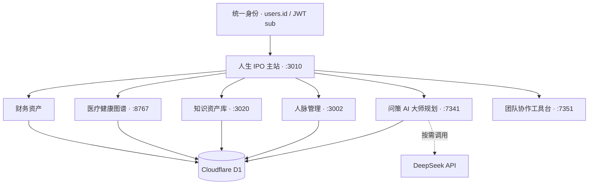

<p align="center">
  
</p>

<h1 align="center">衡 · 人生 IPO</h1>

<p align="center">
  <strong>把财务、健康、知识、人脉与行动，放进同一套可度量、可规划、可复盘的个人数据操作系统。</strong>
</p>

<p align="center">
  
  
  
  
  
  
</p>

<p align="center">
  <a href="#-快速开始">快速开始</a> ·
  <a href="#-系统全景">系统全景</a> ·
  <a href="#-安全与隐私">安全与隐私</a> ·
  <a href="#-路线图">路线图</a>
</p>

---

## 一句话介绍

传统记账软件只回答“钱去了哪里”，人生 IPO 进一步回答：

> 我拥有什么？我的健康、能力与关系是否在增值？下一阶段最值得投入的事情是什么？计划能否真正执行？

项目以 `users.id` / JWT `sub` 为唯一身份主键，将资产负债、现金流、健康指标、知识成果、人脉档案、AI 问策与团队执行统一在一套数据闭环中。所有业务数据按用户隔离，专业子系统共享主账号上下文，不再形成互相割裂的数据孤岛。

## ✨ 核心能力

| 领域 | 能力 | 关键产出 |
|---|---|---|
| 💰 财务资产 | 收支、预算信封、账户、资产、负债、投资组合、跨市场行情 | 三张报表、净资产趋势、现金流与配置结构 |
| 🫀 健康资产 | 科室卡片、检查大项/小项、连续指标、影像、诊疗路径、医保保障 | 健康信号、Nature 风格趋势、3D 图谱与医疗时间轴 |
| 📚 知识资产 | 学历、证书、知识产权、技能与作品档案 | 能力雷达、成果证据链与知识资本台账 |
| 🤝 人脉资产 | 人物档案、关系温度、互动时间线、资料上传与识人分析 | 关系网络、沟通策略、可核验的识人报告 |
| 🧭 AI 问策 | 五域数据主动读取、19 个决策维度、多轮质询、红队与综合裁决 | 事实简报、分歧网络、行动计划、RACI、指标与复盘 |
| 🌌 个人 / 团队 | 看板、甘特图、OKR、RACI、投票、审批、复盘与协作驾驶舱 | 从个人判断到团队执行的完整闭环 |

### 设计原则

- **一个身份底座**：主站统一认证，服务端始终从 JWT 推导租户，客户端不能修改数据归属。
- **五域事实先于 AI 结论**：问策系统主动读取当前用户数据，只追问会实质改变结论的未知项。
- **记录不等于洞察**：连续指标、趋势图、证据来源和反证条件共同构成可复盘判断。
- **计划必须可执行**：每项建议尽量落到负责人、期限、领先指标、停止条件和复盘节奏。
- **本地优先、最小暴露**：专业工作台默认监听回环地址；密钥、数据库和个人附件不进入仓库。

## 🖼️ 产品预览

<p align="center">
  <strong>14 / 14 个主页面与专业工作台入口</strong><br />
  <sub>以下界面均使用脱敏演示数据，覆盖人生 IPO 的完整产品主线。</sub>
</p>

<table>
  <tr>
    <td width="50%">
      
      <p align="center"><sub><strong>财务总览</strong> · 净资产、结余、负债压力与资产配置</sub></p>
    </td>
    <td width="50%">
      
      <p align="center"><sub><strong>预算与收支</strong> · 零基预算与专业收支表</sub></p>
    </td>
  </tr>
  <tr>
    <td width="50%">
      
      <p align="center"><sub><strong>资产负债表</strong> · 统一财务与非财务人生资产</sub></p>
    </td>
    <td width="50%">
      
      <p align="center"><sub><strong>投资组合</strong> · 跨市场估值与盈亏跟踪</sub></p>
    </td>
  </tr>
  <tr>
    <td width="50%">
      
      <p align="center"><sub><strong>账户中心</strong> · 多账户余额与归集口径</sub></p>
    </td>
    <td width="50%">
      
      <p align="center"><sub><strong>现金流量表</strong> · 经营、投资、融资三类现金流</sub></p>
    </td>
  </tr>
  <tr>
    <td width="50%">
      
      <p align="center"><sub><strong>健康资产</strong> · 健康信号、科室诊疗卡片、时间轴与 3D 图谱</sub></p>
    </td>
    <td width="50%">
      
      <p align="center"><sub><strong>知识资产</strong> · 学历、证书、知识产权、技能与作品五藏阁</sub></p>
    </td>
  </tr>
  <tr>
    <td width="50%">
      
      <p align="center"><sub><strong>人脉资产</strong> · 关系温度、待办、生日与经营节奏</sub></p>
    </td>
    <td width="50%">
      
      <p align="center"><sub><strong>问策 · AI 大师规划</strong> · 多维研判、行动计划与补充核查</sub></p>
    </td>
  </tr>
  <tr>
    <td width="50%">
      
      <p align="center"><sub><strong>个人 / 团队</strong> · 双模块选择入口</sub></p>
    </td>
    <td width="50%">
      
      <p align="center"><sub><strong>团队工作台</strong> · 组织、任务、RACI 与协作执行</sub></p>
    </td>
  </tr>
  <tr>
    <td width="50%">
      
      <p align="center"><sub><strong>个人认知工具</strong> · 本地 Skills 的流程化编排</sub></p>
    </td>
    <td width="50%">
      
      <p align="center"><sub><strong>数据文件库</strong> · 分域 JSON 与完整人生 IPO 数据包</sub></p>
    </td>
  </tr>
</table>

> 截图中的金额、姓名、医疗记录和组织信息均为演示数据。

## 🧩 系统全景



### 本地服务

| 服务 | 默认地址 | 技术栈 |
|---|---|---|
| 人生 IPO 主站 | `http://localhost:3010` | Vinext / React 19 / Cloudflare D1 |
| 人脉管理（温故） | `http://127.0.0.1:3002` | React / Vite |
| 知识资产库 | `http://127.0.0.1:3020` | React / Hono / SQLite |
| 医疗健康图谱 | `http://127.0.0.1:8767` | Three.js / Node.js / SQLite |
| 问策 · AI 大师规划 | `http://127.0.0.1:7341` | Python 标准库 / SSE / DeepSeek |
| 星轨团队协作工具台 | `http://localhost:7351/work` | React / Hono / WebSocket / SQLite |

## 🚀 快速开始

### 环境要求

- Windows 10/11（当前一键启动器）
- Node.js `>= 24`（仅运行主站时 `>= 22.13.0`）
- Python `>= 3.11`
- npm；团队模块建议通过 Corepack 使用 pnpm

### 1. 安装依赖

```powershell
npm install
npm --prefix ".\人脉管理\app" install
npm --prefix ".\知识资产\app" install

corepack enable
pnpm --dir ".\团队协作工具台\app" install
pnpm --dir ".\团队协作工具台\app" build
```

### 2. 创建本地部署配置

```powershell
Copy-Item ".\.openai\hosting.example.json" ".\.openai\hosting.json"
```

本地开发可以保留示例 `project_id`；部署前请替换为自己的 Sites 项目 ID，并配置 D1 绑定 `DB`。

### 3. 一键启动

```powershell
powershell -ExecutionPolicy Bypass -File ".\start_life_ipo.ps1"
```

也可以双击 `一键打开人生IPO.vbs`。启动器会检查各服务指纹，全部就绪后再打开主站；日志只写入已忽略的 `launcher-logs/`。

### 4. 仅运行主站

```powershell
npm run dev -- --port 3010
```

## 🗂️ 仓库结构

```text
.
├─ app/                         # 主站页面与用户级 API
├─ lib/                         # 鉴权、加密与测试数据支持
├─ worker/                      # Cloudflare Worker 入口
├─ 人脉管理/app/                # 温故 · 人脉资产工作台
├─ 知识资产/app/                # 知识资本档案库
├─ 医疗健康图谱/                # 3D 解剖、科室、检查与诊疗系统
├─ 问策大师规划系统/            # 1.2.1-balanced AI 决策系统
├─ 团队协作工具台/app/          # 星轨团队执行工作台
├─ tests/                       # 主站验证与端到端检查
├─ tools/                       # 本地维护工具
├─ start_life_ipo.ps1           # 六服务总启动器
└─ 系统文件库.md                # 数据边界、接口与文件索引
```

详细数据表、同步边界和接口口径见 [系统文件库.md](./系统文件库.md)。

## 🔐 安全与隐私

人生 IPO 会处理财务、健康与关系数据。部署前请至少完成以下配置：

1. 为主站设置高强度 `JWT_SECRET` 和独立的 `AI_CREDENTIALS_SECRET`。
2. 为健康服务设置 `SESSION_SECRET` 与 `HEALTH_DATA_KEY`。
3. 为知识与团队服务分别设置独立的 `APP_SECRET` 和数据库地址。
4. DeepSeek Key 只通过页面保存或进程环境变量注入，不写入源码、截图、日志或 JSON 导出。
5. 不要提交 `.env`、`*.db`、`*.sqlite*`、用户上传文件、构建目录和启动日志；仓库根规则已统一拦截。
6. 公网部署应增加 HTTPS、速率限制、备份加密、审计日志和最小权限策略。

DeepSeek Key 在主站中以 AES-GCM 密文按 `users.id + provider` 保存；运行时明文只在同一 Bearer 授权下短暂读取。财务、健康、知识、人脉与规划 JSON 导出会移除行级 `user_id`，并排除密码、JWT、API Key 与图片二进制。

> 如果密钥曾出现在聊天、日志或历史构建产物中，请先在服务商控制台撤销并重新生成，再继续部署。

## 📦 用户数据字典

统一接口：

```http
GET /api/data-library?scope=finance|health|knowledge|contacts|planning|all
Authorization: Bearer <JWT>
```

导出格式：

```json
{
  "format": "life-ipo-json-dictionary",
  "version": "4.0",
  "scope": "finance",
  "exportedAt": "ISO-8601",
  "owner": {
    "userId": 1,
    "username": "example"
  },
  "datasets": {}
}
```

问策系统会自动读取当前登录用户的五域字典；手动上传只作为同一用户的历史快照与兼容入口。

## 🧪 质量检查

```powershell
npm run lint
npm test

python -m unittest discover ".\问策大师规划系统\tests"
```

各子项目也可在自己的 `app` 目录运行 `npm run build`、`npm run check` 或 `npm test`。

## 🗺️ 路线图

- [x] 财务、健康、知识、人脉、规划五域用户数据底座
- [x] JSON V4.0 分域导出与当前用户隔离
- [x] 科室检查大项 / 小项、连续结果与影像元数据
- [x] 19 维 AI 问策、真实模型讨论、事实审计与行动计划
- [x] 个人 / 团队入口与团队执行工作台
- [ ] 统一迁移系统与版本化数据库 schema
- [ ] 跨平台启动器与容器化本地部署
- [ ] 自动化脱敏演示数据与公开 Demo
- [ ] 可选端到端加密备份
- [ ] 插件化认知工具与个人执行日历

## 🤝 参与贡献

欢迎通过 Issue 提交需求、数据口径问题、医疗/保险专业建议与安全报告。提交代码前建议：

1. 每个 PR 只解决一个清晰问题；
2. 涉及数据库时说明迁移与回滚策略；
3. 涉及健康、保险或投资时标注证据来源与适用边界；
4. 不提交真实个人数据、密钥、账号凭据或未经许可的第三方模型资源；
5. UI 改动附桌面端与移动端截图。

## 🙏 灵感与致谢

财务产品结构参考了 Actual Budget、Firefly III、Ghostfolio 与 Finanze 的公开交互范式；行情扩展研究参考 AKShare、yfinance 与 OpenBB。项目为独立实现，不复制其品牌素材或源代码。

医疗 3D 资源的来源与许可见 [STANFORD_FEMALE_MODEL_ATTRIBUTION.txt](./医疗健康图谱/models/STANFORD_FEMALE_MODEL_ATTRIBUTION.txt)。体积较大或需要单独授权的上游原始模型包不纳入 Git 仓库。

## ⚠️ 重要声明

本项目仍处于 Alpha 阶段，仅用于个人信息管理与决策辅助：

- 不构成医疗诊断、处方或治疗建议；
- 不构成投资、保险、税务或法律意见；
- AI 结论可能出错，关键决策必须由用户和相应持证专业人士复核；
- 当前仓库尚未指定开源许可证，公开可见不等于自动授予复制、修改或再分发权利。

---

<p align="center">
  <strong>衡者，知衡、管衡、持衡。</strong><br />
  <sub>让数据沉淀为资产，让计划经得起执行。</sub>
</p>
